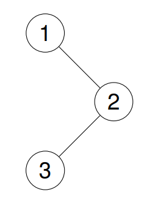

# Problem: 145. Binary Tree Postorder Traversal
**Category:** Trees

**Difficulty:** Easy

**Leetcode Link:** [https://leetcode.com/problems/binary-tree-postorder-traversal/](https://leetcode.com/problems/binary-tree-postorder-traversal/)

**Status:** Finished, open to suggestions.
---

## Problem Statement

Given the root of a binary tree, return the postorder traversal of its nodes' values.

Example 1:
Input: root = [1,null,2,3]
Output: [3,2,1]

Explanation: 

Example 2:
Input: root = [1,2,3,4,5,null,8,null,null,6,7,9]
Output: [4,6,7,5,2,9,8,3,1]

Explanation: 

Example 3:
Input: root = []
Output: []

Example 4:
Input: root = [1]
Output: [1]

Constraints:

- The number of the nodes in the tree is in the range [0, 100].
- -100 <= Node.val <= 100

Follow up: Recursive solution is trivial, could you do it iteratively?

---
## Approach

### Thought Process
A Tree is a DS which consists of a node, a custom data type that consists of:
1. A value (usually an integer)
2. A pointer to it's left node
3. A pointer to it's right node

Now, what's an postorder traversal? It's a travel-through-tree algorithm, which distinctive core idea is to check the tree using this order: left -> right -> node.

### Strategy Used

2 recursions and a base case is needed:
- If the current node is null, means we've reached a dead end for the current branch, return
- Visit the left node of the current one
- Visit the right node of the current one if it hasn't been visited
- Save the root value

Iterative approach needs a changing approach: As you emulate the recursive calls using an stack, we must keep track of the visited nodes. Why? Because you can't process the current node if it has non-processed right nodes.

---
## Results
1. Recursive approach:
### Complexity Analysis
- **Time Complexity:** O(n)
- **Space Complexity:** O(h), h = tree's height, 0 <= h <= n

### Time execution
- **Time spent:** 0ms (100.00%)
- **Memory used:** 53.46 mb (67.60%)

2. Iterative approach:
### Complexity Analysis
- **Time Complexity:** O(n)
- **Space Complexity:** O(h), h = tree's height, 0 <= h <= n

### Time execution
- **Time spent:** 0ms (100.00%)
- **Memory used:** 54.36 mb (10.59%)

---
## Notes / Learnings
- Once again, test cases were really confusing, I suggest focusing on understanding the 'postorder' definition
- Follow-up accomplished, in which the iterative approach really performs worser than the recursive one
